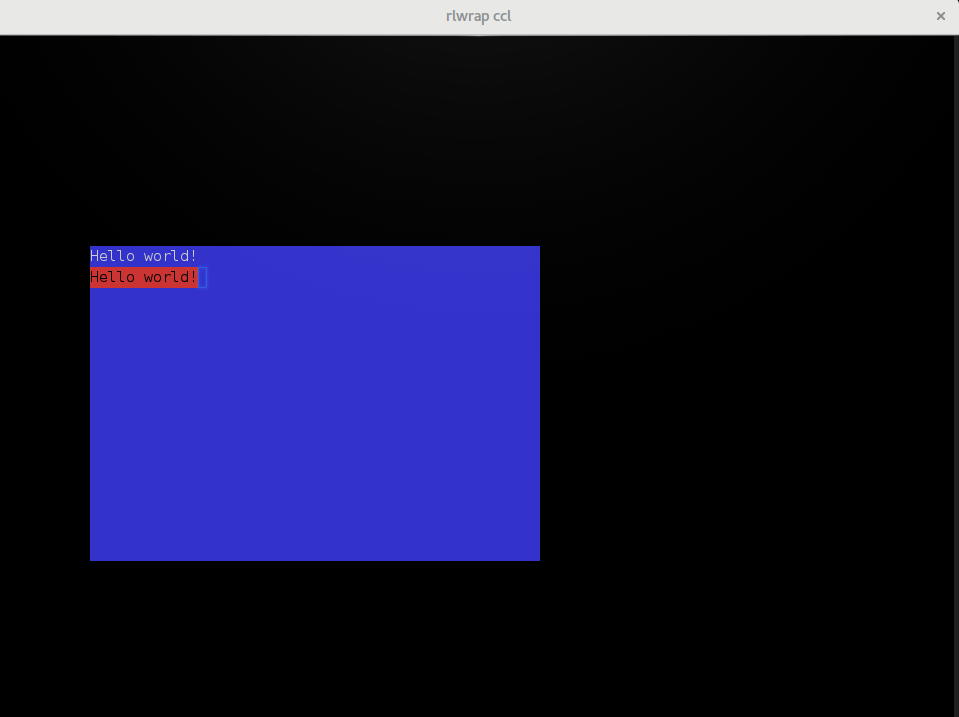

# Writing new CLIM backend

This work is meant as a showcase how to write new McCLIM backends. To make it
more interesting to me I'm writing it using `cl-charms` library which is a
Common Lisp library for `ncurses` - console manipulation library for UNIX
systems. During development I'm planning to make notes about necessary steps and
possibly provide general tests for McCLIM calling necessary system parts of the
backend (in order which reflects which parts must be implemented first). That
should simplify verifying, if new backends work fine.

## cl-charms crash course

Ensure you have ncurses development package installed on your system. Start the
real terminal (Emacs doesn't start `*inferior-lisp*` in something ncurses can
work with) and launch your implementation. After that start swank server and
connect from your Emacs session.

```
~ ccl
? (ql:quickload 'swank :silent t)
? (SWANK)
? (swank:create-server :port 4005 :dont-close t) 
;; Swank started at port: 4005.
4005
?
```

In Emacs: `M-x slime-connect *Host:* localhost *Port:* 4005`. Now we are working
in `*slime-repl ccl*` buffer in Emacs and we have ncurses output in the terminal
we have launched server from. Try some demos bundled with the library:

```
CL-USER> (ql:quickload '(cl-charms-paint cl-charms-timer) :silent t)
(CL-CHARMS-PAINT CL-CHARMS-TIMER)
CL-USER> (charms-timer:main) ; quit with Q, start/stop/reset with [SPACE]
CL-USER> (charms-paint:main) ; quit with Q, move with WSAD and paint with [SPACE]
```

Now we will go through various `charms` (and `ncurses`) capabilities. Our final
goal is to have a window with two buttons and text input box. Navigation should
be possible with `[TAB]` / `[SHIFT]+[TAB]` and by selecting gadgets with a mouse
pointer. Behold, time for the first application.

### First application

Time to write simple application.  Lets dissect a simple program printing hello
world:

```common-lisp
(defun hello-world ()
  (charms:with-curses ()
    (charms:disable-echoing)
    (loop named hello-world
       with window = (charms:make-window 50 50 10 10)
       do (progn
            (charms:clear-window window)
            (charms:write-string-at-point window "Hello world!" 0 0)
            (charms:refresh-window window)

            ;; Process input
            (when (eql (charms:get-char window) #\q)
              (return-from hello-world))
            (sleep 0.1)))))
```

Program must be wrapped in `charms:with-curses` macro which ensures proper
initialization and finalization of the problem. In this operator context
`charms` functions for configuring library are available. We use one of them
`charms:disable-echoing` to prevent unnecessary obfuscation of window (we
interpret characters ourself). `charms:*standard-window*` is a window covering
whole terminal screen.

We create a Window for output (its size is 50x15 and offset is 10x10) and then
in a loop we print "Hello world!" (at the top-left corner of it) until user
press `q`.

### Extending cl-charms API

All functions we have used until now come from higher-level
interface. `cl-charms` has also low-level interface which maps to libncurses via
CFFI (package `charms/ll`). I highly recommend skimming through
http://www.tldp.org/HOWTO/NCURSES-Programming-HOWTO which is a great overview of
`ncurses` functionality.

I want borders around our window, but CFFI interface is ugly (i.e I'd have to
extract window pointer to call `wborder`). We are going to abstract this with a
function which plays nice with the lispy abstraction.

```
(defun draw-window-border (window
                           &optional
                             (ls #\|) (rs #\|) (ts #\-) (bs #\-)
                             (tl #\+) (tr #\+) (bl #\+) (br #\+))
  (apply #'charms/ll:wborder (charms::window-pointer window)
         (mapcar #'char-code (list ls rs ts bs tl tr bl br))))

(defun draw-window-box (window &optional (verch #\|) (horch #\-))
  (charms/ll:box (charms::window-pointer window) (char-code verch) (char-code horch)))
```

Now we can freely use `draw-window-border` in our application. Put
`(draw-window-box window)` after `(charms:clear-window window)` in our
`hello-world` program and see the result. It is ugly, but what did you expect
from a window rendered in the terminal?


It is worth mentioning, that border is drawn inside the window, so when we start
writing string at point [0,0] - it overlaps with the border. If we want to paint
content *inside* the border we should start at least at [1,1] and stop at [48,13].

Somewhat more appealing result may be achieved by having distinct window
background instead of drawing a border with characters. To do that we need to
root in `charms/ll` interface once more. We define colors API.

```common-lisp
(defun start-color ()
  (when (eql (charms/ll:has-colors) charms/ll:FALSE)
    (error "Your terminal does not support color."))
  (let ((ret-code (charms/ll:start-color)))
    (if (= ret-code 0)
        T
        (error "start-color error ~s." ret-code))))

(eval-when (:load-toplevel :compile-toplevel :execute)
  (defconstant +black+   charms/ll:COLOR_BLACK)
  (defconstant +red+     charms/ll:COLOR_RED)
  (defconstant +green+   charms/ll:COLOR_GREEN)
  (defconstant +yellow+  charms/ll:COLOR_YELLOW)
  (defconstant +blue+    charms/ll:COLOR_BLUE)
  (defconstant +magenta+ charms/ll:COLOR_MAGENTA)
  (defconstant +cyan+    charms/ll:COLOR_CYAN)
  (defconstant +white+   charms/ll:COLOR_WHITE))

(defmacro define-color-pair ((name pair) foreground background)
  `(defparameter ,name (progn (charms/ll:init-pair ,pair ,foreground ,background)
                              (charms/ll:color-pair ,pair))))

(define-color-pair (+white/blue+ 1) +white+ +blue+)
(define-color-pair (+black/red+ 2) +black+ +red+)

(defun draw-window-background (window color-pair)
  (charms/ll:wbkgd (charms::window-pointer window) color-pair))

(defmacro with-colors ((window color-pair) &body body)
  (let ((winptr (gensym)))
    `(let ((,winptr (charms::window-pointer ,window)))
       (charms/ll:wattron ,winptr ,color-pair)
       ,@body
       (charms/ll:wattroff ,winptr ,color-pair))))
```

`start-color` must be called when we configure the library. We map `charm/ll`
constants to lisp constants and create `define-color-pair` macro. This
abstraction could be improved so we are not forced to supply pair numbers and
providing proper association between names and integers, but we skip that step
for brievity. We define two color pairs, function for filling a window
background and macro `with-colors` for drawing with a specified palette. Finally
we use our new abstraction in `pretty-hello-world` function:

```common-lisp
(defun pretty-hello-world ()
  (charms:with-curses ()
    (charms:disable-echoing)
    (start-color)
    (loop named hello-world
       with window = (charms:make-window 50 15 10 10)
       do (progn
            (charms:clear-window window)
            (draw-window-background window +white/blue+)
            (with-colors (window +white/blue+)
              (charms:write-string-at-point window "Hello world!" 0 0))
            (with-colors (window +black/red+)
              (charms:write-string-at-point window "Hello world!" 0 1))
            (charms:refresh-window window)

            ;; Process input
            (when (eql (charms:get-char window :ignore-error t) #\q)
              (return-from hello-world))
            (sleep 0.1)))))
```

Final result looks as promised in the function name – very pretty ;-)


